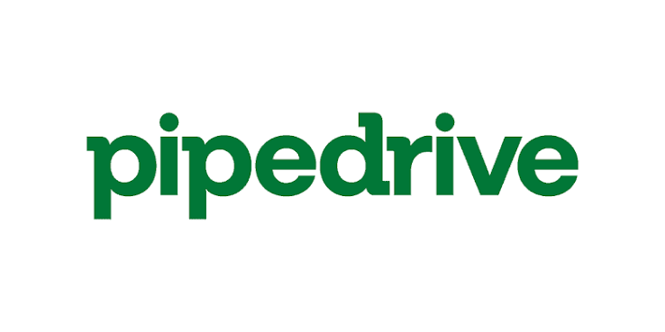

# Pipedrive MCP Server

<p align="center">
  
</p>

Connect Pipedrive to Claude Desktop, Claude Code, Codex, or another MCP client.

This server runs locally and uses your own Pipedrive API token. It starts in read-only mode, does not expose delete operations, and keeps credentials outside the Git repository.

## What you can do

- Search deals, people, and organizations.
- Read deal, person, and organization details.
- List activities and notes.
- Create activities and notes when write access is enabled.
- Update selected deal and person fields when write access is enabled.
- Read useful Pipedrive schema resources from an MCP client.

## Before you start

You need:

- [Node.js](https://nodejs.org/) 20 or newer.
- [Git](https://git-scm.com/).
- A Pipedrive account with access to a personal API token.
- Claude Desktop, Claude Code, Codex, or another local MCP client.

This version is intended for one user connecting their own Pipedrive account. A public multi-user service should use Pipedrive OAuth instead of shared API tokens.

## Install

### 1. Download and build the server

macOS or Linux:

```bash
git clone https://github.com/gkp-dev/pipedrive-mcp-server.git
cd pipedrive-mcp-server
npm ci
cp .env.example .env
npm run build
```

Windows PowerShell:

```powershell
git clone https://github.com/gkp-dev/pipedrive-mcp-server.git
Set-Location pipedrive-mcp-server
npm ci
Copy-Item .env.example .env
npm run build
```

### 2. Get your Pipedrive API token

In Pipedrive, open:

`Settings > Personal preferences > API`

Copy your personal API token. If the API section is missing, ask a Pipedrive administrator to enable access to personal API tokens for your permission set.

Important:

- The token gives access to the Pipedrive data available to your user.
- Each Pipedrive company has a different token.
- Regenerating the token disables integrations that use the previous token.
- Never commit, publish, or share the token.

See the official [Pipedrive token guide](https://pipedrive.readme.io/docs/how-to-find-the-api-token) and [authentication reference](https://pipedrive.readme.io/docs/core-api-concepts-authentication).

### 3. Configure the server

Open the `.env` file created during installation:

```env
PIPEDRIVE_API_TOKEN=replace-with-your-own-token
PIPEDRIVE_READ_ONLY=true
```

Keep `PIPEDRIVE_READ_ONLY=true` for the first setup. The server will allow searches and reads, but reject every write operation.

### 4. Connect your MCP client

Choose the guide for your client:

- [Claude Desktop and Claude Code](docs/claude-desktop.md)
- [Codex CLI, app, and IDE extension](docs/codex.md)

The client must launch this file with Node.js:

```text
/absolute/path/to/pipedrive-mcp-server/build/index.js
```

Use an absolute path. The server loads `.env` from its own installation folder, so the token does not need to be copied into the client configuration.

## Verify the connection

Ask your client:

```text
List the Pipedrive tools you can use.
```

Then try a read-only request:

```text
Search Pipedrive deals containing "Acme".
```

Do not run `npm start` in a separate terminal for normal use. Claude or Codex starts the local process automatically. If you run it manually, it waits for MCP messages on standard input, which is expected.

## Enable write operations

Change the value in `.env` only after read-only requests work:

```env
PIPEDRIVE_READ_ONLY=false
```

Restart the MCP client. Claude or Codex can then create activities, add notes, and update the allowed fields. Delete operations are not exposed.

Test write access on a dedicated Pipedrive record before using it with production data.

## Environment variables

| Variable | Required | Default | Purpose |
|---|---:|---|---|
| `PIPEDRIVE_API_TOKEN` | Yes | None | Personal Pipedrive API token. |
| `PIPEDRIVE_READ_ONLY` | No | `true` | Blocks all write tools when enabled. |
| `PIPEDRIVE_DEFAULT_LIMIT` | No | `25` | Default number of returned records. |
| `PIPEDRIVE_REQUEST_TIMEOUT_MS` | No | `30000` | Request timeout in milliseconds. |

Accepted boolean values are `true`, `false`, `1`, `0`, `yes`, `no`, `on`, and `off`. Invalid values are rejected.

## Available tools

Read tools:

- `pipedrive_search_deals`
- `pipedrive_get_deal`
- `pipedrive_search_persons`
- `pipedrive_get_person`
- `pipedrive_search_organizations`
- `pipedrive_get_organization`
- `pipedrive_list_activities`
- `pipedrive_list_notes`

Write tools, blocked when `PIPEDRIVE_READ_ONLY=true`:

- `pipedrive_update_deal`
- `pipedrive_update_person`
- `pipedrive_create_activity`
- `pipedrive_add_note`

## Development

```bash
npm run typecheck
npm test
npm run build
npm audit --audit-level=moderate
```

## Troubleshooting

### `PIPEDRIVE_API_TOKEN is required`

Confirm that `.env` exists beside `package.json` and contains `PIPEDRIVE_API_TOKEN`.

### The client cannot start the server

- Run `npm run build` again.
- Confirm that `build/index.js` exists.
- Use absolute paths for both Node.js and `build/index.js` when the client cannot find `node`.
- Fully restart the MCP client after changing its configuration.

### Write tools are rejected

This is expected while `PIPEDRIVE_READ_ONLY=true`. Change it only if you explicitly want write access.

### The token works in one company but not another

Pipedrive uses a different personal token for each company. Copy the token from the company you want to connect.

## Distribution roadmap

The current installation is source-based and local. Planned improvements include:

- An npm package for shorter command-line installation.
- A signed `.mcpb` bundle for one-click Claude Desktop installation.
- Pipedrive OAuth for a real multi-user distribution.

See [ROADMAP.md](ROADMAP.md) for the current project status.

## License

[MIT](LICENSE)
